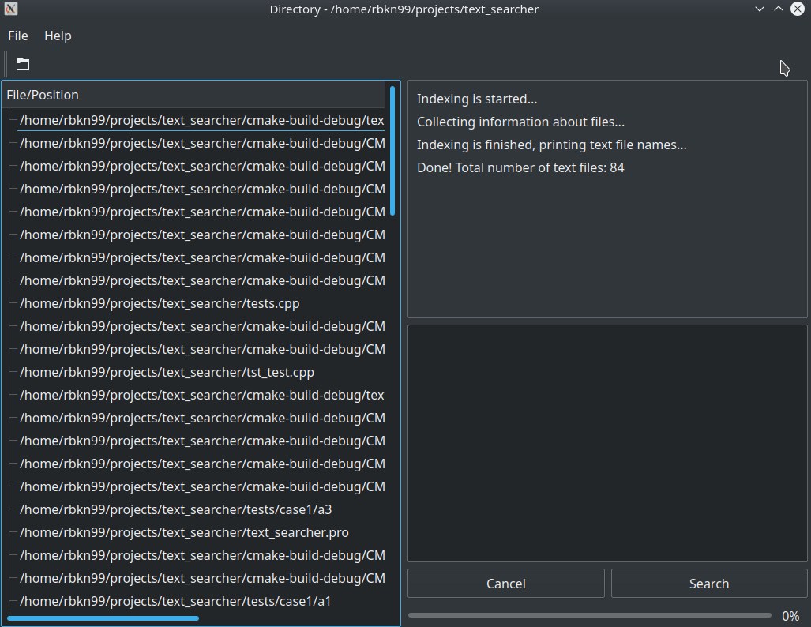
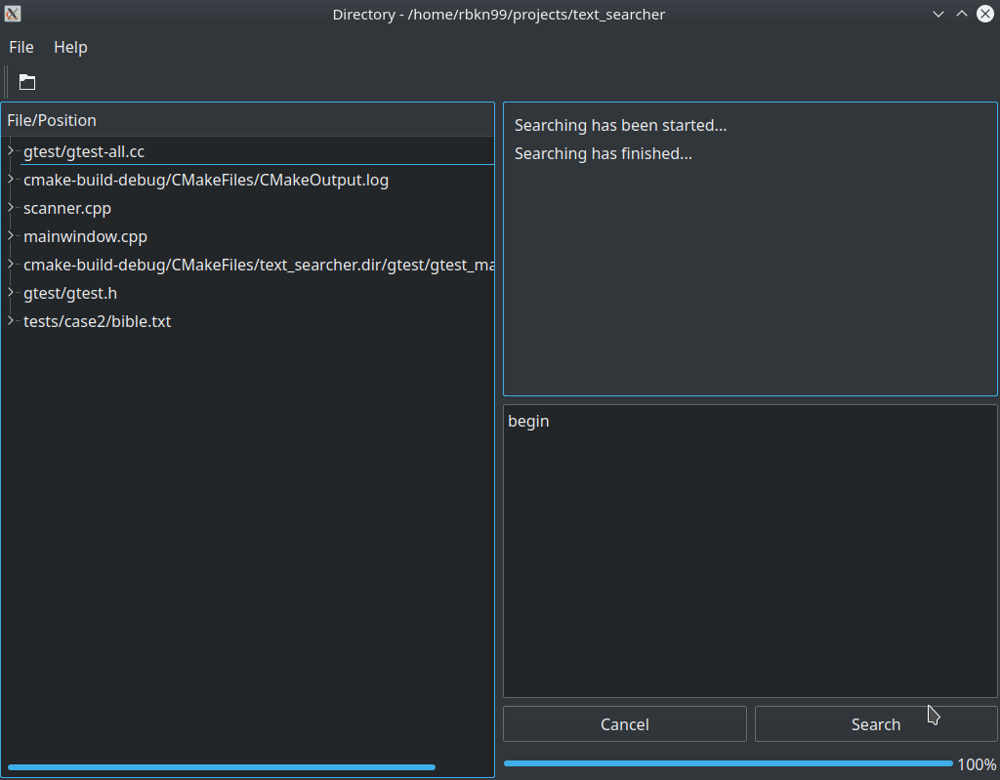

# Text Searcher

Fast and easy-to-use desktop app for searching strings in files.  It uses trigram technique and multi-threading for boosting.

### Usage

```bash
$ git clone https://github.com/rbkn99/text_searcher
$ cd text_searcher
$ mkdir text_searcher_build && cd text_searcher_build
$ cmake ..
$ make
$ ./text_searcher
```

### Example

 
